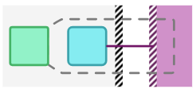

# 微服务架构测试策略

> 整理翻译自Toby Clemson的《Testing Strategies in a Microservice Architecture》文章，英文原文出处：<https://martinfowler.com/articles/microservice-testing/>

在过去几年中，基于服务的架构已经转向更小，更集中的“微型”服务。这种方法有许多好处，例如能够独立部署，扩展和维护每个组件，并在多个团队之间并行化开发。但是，一旦引入了这些额外的网络分区，就需要重新考虑应用于巨石应用程序的测试策略。

在这里，我们将讨论一些方法——如何管理多个独立部署组件的额外测试的复杂性，以及如何让多个团队各自担任不同服务的监护人，以便如何进行测试和保持应用程序的正确。

## 内容
### 定义
- 什么是微服务？
- 剖析：微服务内部结构
- 架构：服务编排
### 测试策略
- 单元：mockist vs. classic
- 集成：数据存储和外部服务
- 组件：进程内或进程外？
- 契约：保证夸边界的一致性
- 端到端：技巧和窍门
### 一些结论
- 选项：微服务测试的好处
- 测试金字塔：需要多少测试？
- 总结

## 微服务架构使用一组相互协作的服务来构架软件

微服务架构是在架构层面应用单一责任原则的自然结果。与传统的单片架构相比，这带来了许多好处，例如独立可部署性，语言，平台和不同组件的技术独立性，不同的可扩展性轴和增强的架构灵活性。

**微服务在规模方面，没有严格的规则**。通常，微服务是数百行的数量级，但根据它们所包含的职责，可以是数十或数千行。一个好的，但非确切（non-specific）的经验法则是——*as small as possible but as big as necessary*，以便表示他们拥有的领域概念（Domain Concept）。 ["How big should a micro-service be?"](http://bovon.org/2013/07/09/how-big-should-a-micro-service-be/)中表述了更多细节。

**微服务通常使用基于HTTP协议的REST风格API进行集成**。通过这种方式，业务域概念被建模为资源，一个服务管理一个或多个这样的资源。在最成熟的RESTful系统中，使用超媒体（hypermedia）控件链接资源，使得每个资源的位置对于服务的消费者是可见的。有关详细信息，请参阅[Richardson Maturity Model](https://martinfowler.com/articles/richardsonMaturityModel.html)。

有时使用其他可用的集成机制，例如轻量级消息传递协议，发布 - 订阅模型或其他传输协议，例如Protobuf或Thrift。

每个微服务可以提供或不提供某种形式的用户界面。

## 微服务通常可以分成类似的模块

 通常微服务的内部结构由如图所示的结构组成。

所采用的任何测试策略都应**旨在为每层和服务层之间提供覆盖**，同时保持轻量级。

- 绿色部分：资源充当服务暴露的应用程序协议和表示领域的对象的消息之间的映射器。通常，它们很薄，负责检查请求的健全性，并根据业务处理的结果提供协议特定的响应。
- 蓝色部分：几乎所有服务逻辑都驻留在表示业务领域的领域模型（Domain）中。在这些对象中，服务（Service）跨多个领域活动进行协调，而Repository则作用于领域实体的集合，并且通常是可以持久化的。
- 紫色部分：如果一个服务具有另一个服务作为协作者，则需要一些逻辑来与外部服务通信。网关（Gateways）封装了使用远程服务传递的消息，从领域对象编组请求和响应。它可能会使用了解底层协议的客户端来处理请求和响应。
- 红色：除了最琐碎的情况或服务充当其他服务所拥有的资源之间的聚合器之外，微服务还需要能够在请求之间持久化领域对象。通常，这是使用对象关系映射（ORM）或更轻量级的数据映射器（Data mapper）实现的，具体取决于持久化的复杂性。通常，Repository使用一组专门的对象对领域模型进行持久化。

## 微服务之间通过网络通信并且使用外部数据库

微服务通过在每个相关模块之间传递消息来处理请求以形成响应。特定请求可能需要与Service/Gateway/Repository进行交互，因此模块之间是松耦合的。

自动化测试应尽可能以最细的粒度为每次通信提供覆盖。因此，每个测试都提供了一个专注的且快速的反馈周期。

---

  

    
  

  

    

      

资源接收请求，并且一旦经过验证，就会调用域以开始处理请求。
      

    

  

  
  

    

      

    如果必须协调许多模块以完成业务事务，则资源委托给服务。
    否则，它直接与相关模块通信。
      

    

  

  
  

    

      

与外部服务的连接需要特别注意，因为它们跨越网络边界。系统应该能够适应远程组件的中断。网关包含处理此类错误情况的逻辑。
      

      

一般的，与外部服务的通信比进程内通讯更加粗粒度，为了降低API的复杂性和延迟。
      

    

  

  
  

    

同样，与外部数据存储的通信也有不同的设计考虑因素。服务通常更多得和数据存储交互而不是外部服务，数据存储位于网络边界外，从而导致延迟和中断风险。
    

  

 
  
  

    

      

网络分区的存在会影响所使用的测试风格。这些模块的测试可能会有更长的执行时间，并且可能由于团队无法控制的原因而失败。        
      

    

  

## 多个微服务一起构成一个系统，提供有价值的业务功能

  
  

    

    

通常，团队将充当一个或多个微服务的监护人。这些服务交换消息以处理更大的业务请求。在交互格式方面，JSON目前最受欢迎，XML是最常见的替代方案
    

		

在某些情况下，异步发布 - 订阅通信机制比同步点对点机制更适合用例。作为在微服务之间实现pub-sub的轻量级方法，Atom syndication格式正变得越来越流行。
    

		

由于业务请求跨越由网络分区分隔的多个组件，因此考虑系统中可能的故障模式非常重要。尽管这些组件可能会宕机，但是可以使用诸如超时（Timeout），断路器（circuit breaker）和舱壁（bulkheads）等技术帮助维持整个系统的正常运行。
    

    

  

  
  

    

    

在较大的系统中，通常有多个团队负责不同的有界上下文（bounded contexts）。
    

		

外部服务的测试问题可能与团队控制下的服务不同，因为对外部团队服务的接口和可用性不能保障。
    

    

  

## UNIT TEST

> ***A unit test exercises the smallest piece of testable software in the application to determine whether it behaves as expected.***
>
> ***单元测试在应用程序中运行最小的可测试软件（单元），以确定其是否按预期运行。***

被测单元的大小没有严格定义，但是单元测试通常是在类级别或一小组相关类下编写的。被测单元越小，使用单元测试就越容易表达行为，因为单元的分支复杂性较低。

通常，编写单元测试的难度可以突出显示何时应将模块分解为独立的更连贯的部分并单独测试。因此，**作为一种有用的测试策略，单元测试也是一种功能强大的设计工具**，尤其是与测试驱动开发（TDD）相结合时。

通过单元测试，您可以看到基于被测单元是否与其协作者隔离的重要区别。

[Sociable unit testing](https://leanpub.com/wewut)的重点是通过观察模块状态的变化来测试模块的行为。这将被测单元视为完全通过其接口测试的黑盒子。

[Solitary unit testing](https://leanpub.com/wewut)着眼于对象及其依赖关系之间的交互和协作，这些关系由[test doubles](https://martinfowler.com/bliki/TestDouble.html)替换

这些单元测试风格并不冲突，并且经常在相同的代码库中使用以解决不同的测试问题。

### 两个风格的单元测试都在微服务中扮演者重要角色

  
  

    

    

Services are commonly a rich domain surrounded by plumbing and coordination code.
    

    

  

---

  
  

    

    

领域逻辑（Domain Logic）通常表现为复杂的计算和状态转换的集合。由于这些类型的逻辑基于状态，因此尝试隔离单元几乎没有价值。这意味着，应该尽可能地将真实的领域对象用于被测单元的所有协作者。
    

    

  

  
  

    

      

使用plumbing code，很难将被测单元与外部模块隔离开来并对状态变化进行测试。因此，使用Test Doubles（Test Doubles指stub,mock等含义）更有效。
      

      

此级别的单元测试的目的是验证用于生成请求的任何逻辑或映射来自外部依赖的响应，而不是以集成方式验证通信。因此，为协作者使用Test Doubles提供了一种以可靠和可重复的方式控制请求/响应的方法。
      

      

此级别的单元测试提供比集成测试更快的反馈，并且可以通过在特殊情况下将Test Doubles响应作为外部依赖来强制错误条件。
      

    

  

  
  

    

      

协作逻辑（Coordination logic）更关心模块之间传递的消息，而不是那些模块中的任何复杂逻辑。使用Test Doubles允许验证传递的消息的细节并且响应桩，所以测试中可以在模块之间指定通信流。
      

      

如果说一段协作逻辑需要太多数量的Test Double，这通常是一个好的指标，暗示一些逻辑需要被抽取出来单独测试。
      

    

  

---

As the size of a service decreases the ratio of plumbing and coordination logic to complex domain logic increases. Similarly, some services will contain entirely plumbing and coordination logic such as adapters to different technologies or aggregators over other services.

In such cases comprehensive unit testing may not pay off. Other levels of testing such as [component testing](https://martinfowler.com/articles/microservice-testing/#testing-component-introduction) can provide more value.

The intention of unit tests and testing in general is to constrain the behaviour of the unit under test. An unfortunate side effect is that sometimes, tests also constrain the implementation. This often manifests with over reliance on mock based approaches.

It is important to constantly question the value a unit test provides versus the cost it has in maintenance or the amount it constrains your implementation. By doing this, it is possible to keep the test suite small, focussed and high value.

### 单独的单元测试不能保证系统的行为

  
  

    

      

到目前为止，我们已经隔离了系统的每个核心模块。但是，当这些模块一起工作以形成完整的服务或它们与远程依赖交互时，这些模块不会被覆盖。
      

      

要验证每个模块是否与其协作者正确交互，需要进行更粗粒度的测试。      

    

  

## INTEGRATION TEST

集成测试验证组件之间的通信路径和交互，以检测接口缺陷。

集成测试将模块收集在一起并作为子系统进行测试，以验证它们是否按预期协作以实现更大的行为。

  
  

    

      

集成测试将模块收集在一起并作为子系统进行测试，以验证它们是否按预期协作以实现更大的行为。他们通过子系统运行通信路径，以检查每个模块关于如何与其对等方交互的任何不正确的假设。
      

      

这与单元测试形成对比，在单元测试中，即使使用真正的协作者，目标也是仅仅测试被测单元的行为，而不是整个子系统。
      

    

  

  
  

    

      

虽然可以以任何粒度编写集成组件或模块的测试，但在微服务架构中，它们通常用于验证集成代码层与它们集成的外部组件之间的交互。
      

    

  

